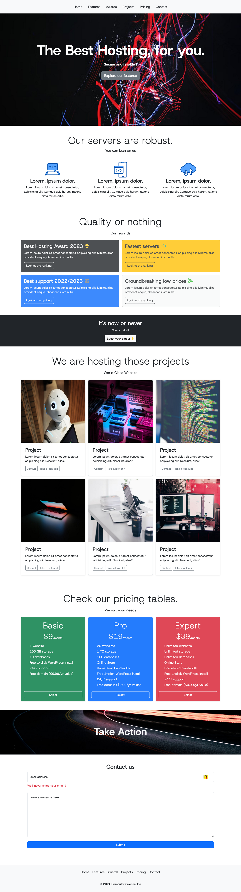

## COMPUTER SCIENCE WEBSITE (INFORMATIQUE WEBSITE)

## Le challenge

Création d'un site complet en HTML5, CSS3 et Bootstrap.

## Démonstration

Lien vers le projet : https://aperbet56.github.io/computer_science/

## Projet développé avec

- Utilisation des balises sémantiques HTML5
- CSS3
- Flexbox
- Animations CSS
- Page web responsive
- Desktop first
- Importation de la police "Host Grotesk"
- Bootstrap
